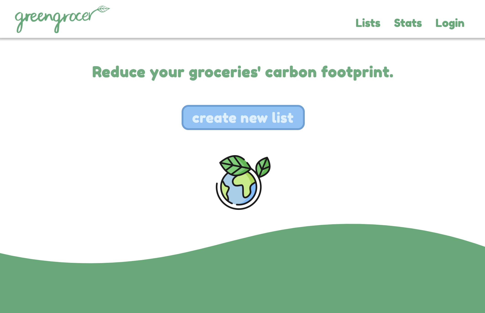
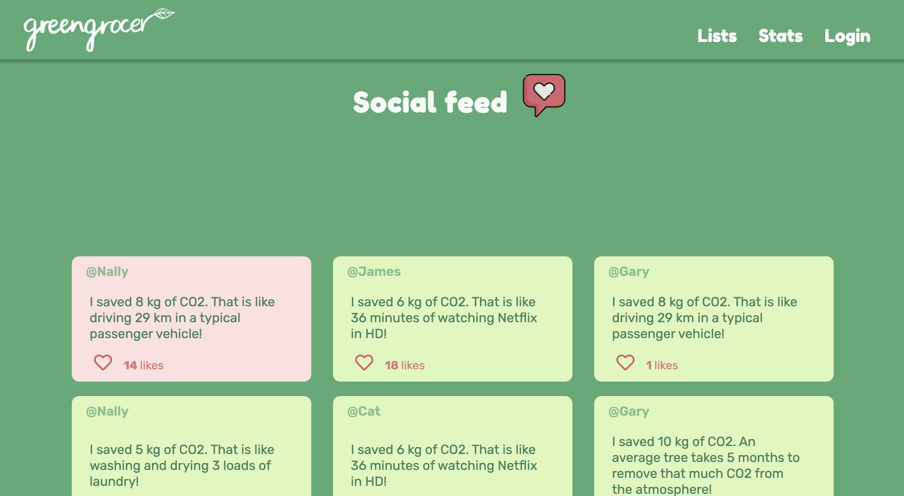
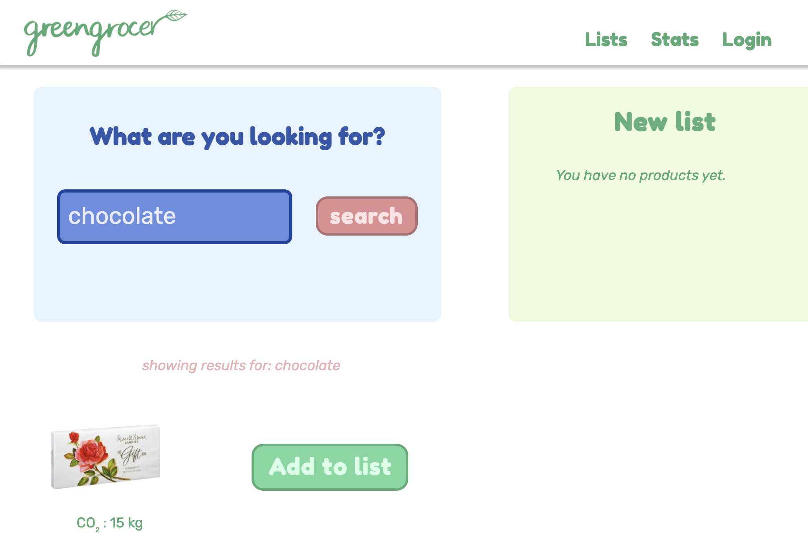
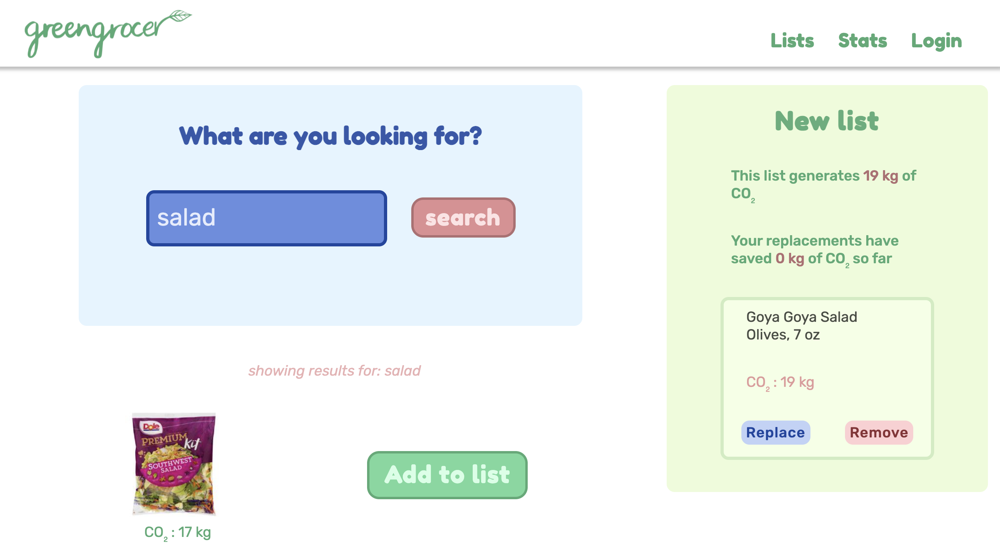
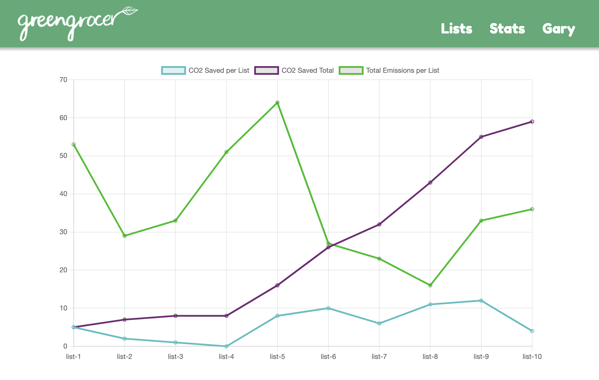

# 🌏 GreenGrocer 🌍
Reduce your groceries' carbon footprint.
Visit now ---> [greengrocer.me](https://www.greengrocer.me)









## 🔧 project setup 
1. run `npm install` in the root directory
2. run `npm install` in the server directory

## 🪄 linting setup
Following Airbnb's react style guide:
- https://www.npmjs.com/package/eslint-config-airbnb
- https://medium.com/@Tunmise/set-up-eslint-with-airbnb-style-guide-in-5-minutes-d7b4cc5707f8
- https://github.com/airbnb/javascript

To lint the entire repository, run `npm run lint`


## 💾 database setup
1. with postgreSQL set up, create a database called greengrocer
2. open postgreSQL interactive terminal (psql) inside the project's root directory
3. run `\i db/schema/schema.sql` to create the tables 
4. run `\i db/seeds/01_users.sql` to seed the database
5. create a .env file inside the root directory and fill in the required fields:
```
POSTGRES_HOST=hostname
POSTGRES_USER=username
POSTGRES_PASSWORD=password
POSTGRES_DB=databasename
POSTGRES_PORT=portnumber
```
6. for a full database reset, run `npm run reset-db` from the root directory

## 🟠 running the app in development mode
1. from the root directory: `npm run dev`

logs coming from express are prefixed with [0] and logs from react are prefixed with [1]


## 🟢 running the app in production mode
1. from the root directory: `npm run prod`
2. navigate to localhost:8081


